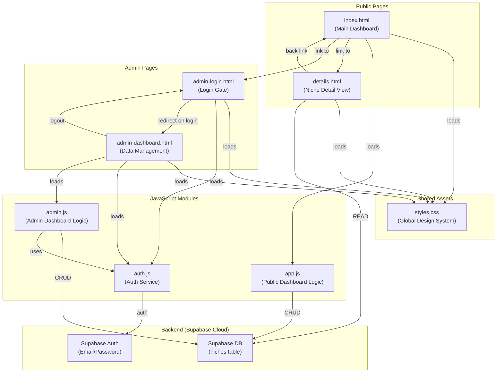
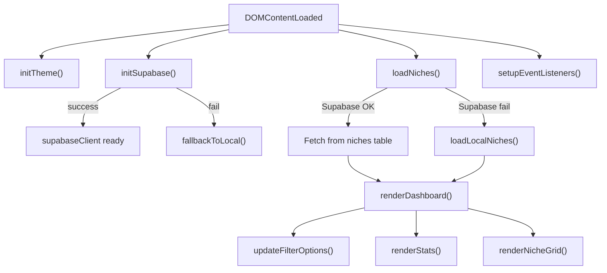
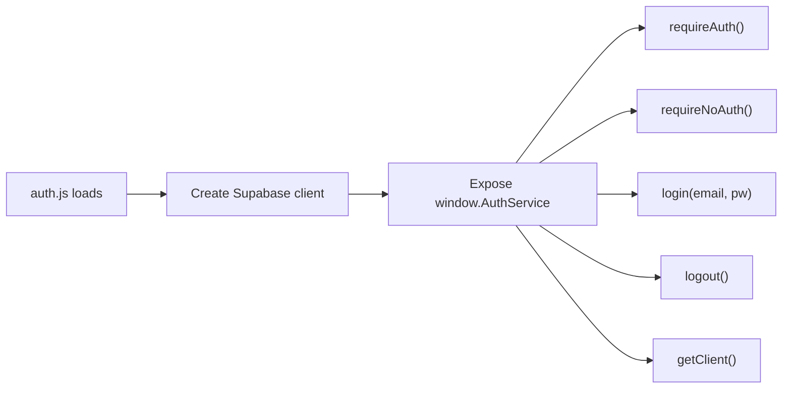
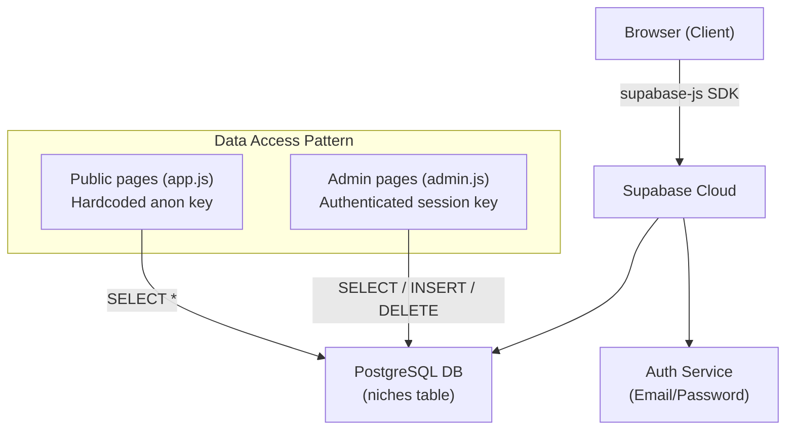
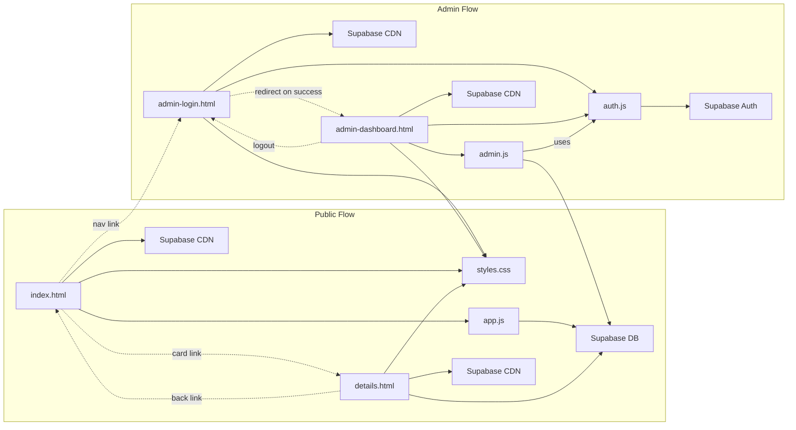

# Rank & Rent Niche Evaluator — Project Analysis

## Project Overview

This is a **static frontend-only web application** (no Node.js, no build tools) that evaluates "Rank & Rent" SEO niches. It uses **Supabase** as a Backend-as-a-Service (BaaS) for database storage and authentication — meaning there is **no custom backend server**. All logic runs client-side in the browser.

---

## Architecture Diagram



---

## File-by-File Breakdown

### 1. [styles.css](file:///d:/rank%20and%20rent%20tools/styles.css) — Global Design System (1,253 lines)

The **single shared stylesheet** used by every HTML page. Key aspects:

| Feature | Details |
|---|---|
| **Font** | `Plus Jakarta Sans` via Google Fonts |
| **Theming** | CSS variables with `:root` (dark) and `[data-theme="light"]` overrides |
| **Design Tokens** | Colors, spacing, radii, shadows, backdrop blur — all CSS custom properties |
| **Component Styles** | Navbar, stat cards, filter bar, niche cards, modals, accordion, form elements, table styles |
| **Responsive** | `@media (max-width: 768px)` breakpoints for grids and layouts |

> [!NOTE]
> Theme switching is handled by toggling `data-theme="light"` on the `<html>` element. The CSS variables automatically cascade to all components.

---

### 2. [index.html](file:///d:/rank%20and%20rent%20tools/index.html) — Main Public Dashboard (335 lines)

The **homepage** that displays all niche evaluations as filterable cards.

**Structure:**
- **Navbar** — Logo + admin login link + theme toggle
- **Stats Row** — 4 stat cards (Total, Passed, Failed, Pass Ratio)
- **Sidebar Filters** — Search, State, Niche, City, Min Zips, Status pills, Export CSV, Advanced filters toggle
- **Advanced Filters Panel** — Max KD, Max Volume, Max GMB Reviews, Max GMB Count, Min Traffic, Population range, DA/Directory/R&R exact filters, Dummy Data generator
- **Niche Grid** — Dynamically populated card grid
- **How It Works Accordion** — Explains the evaluation logic
- **Delete Modal** — Confirmation dialog for deleting records

**Dependencies loaded:**
- `styles.css` — Design system
- FontAwesome 6.4.0 (CDN) — Icons
- Supabase JS v2 (CDN) — Database client
- `app.js` — All dashboard logic

---

### 3. [app.js](file:///d:/rank%20and%20rent%20tools/app.js) — Public Dashboard Logic (1,123 lines)

The **brain of the public-facing dashboard**. Handles everything from data loading to rendering.

**Key Functions & Flow:**



| Function | Purpose |
|---|---|
| [initSupabase()](file:///d:/rank%20and%20rent%20tools/app.js#L101-L121) | Creates Supabase client from hardcoded URL/key or localStorage overrides |
| [loadNiches()](file:///d:/rank%20and%20rent%20tools/app.js#L128-L146) | Fetches all records from Supabase `niches` table; falls back to localStorage |
| [getMockData()](file:///d:/rank%20and%20rent%20tools/app.js#L158-L232) | Generates 3 hardcoded sample records if no data exists |
| [evaluateNicheCriteria()](file:///d:/rank%20and%20rent%20tools/app.js#L339-L440) | **Core business logic** — Evaluates 9 pass/fail rules against a niche record |
| [renderNicheGrid()](file:///d:/rank%20and%20rent%20tools/app.js#L719-L823) | Filters data by current filter state, creates card HTML for each niche |
| [deleteNiche()](file:///d:/rank%20and%20rent%20tools/app.js#L485-L563) | Deletes from Supabase (or localStorage), shows custom confirm modal |
| [generateDummyNiches()](file:///d:/rank%20and%20rent%20tools/app.js#L566-L659) | Creates 5 random niche records respecting current filters, saves to DB |
| [exportDataCSV()](file:///d:/rank%20and%20rent%20tools/app.js#L838-L924) | Exports filtered data as downloadable CSV file |

**The 9 Evaluation Rules (PASS/FAIL criteria):**

| # | Rule | PASS Condition |
|---|---|---|
| 1 | City Zip Codes | `≥ 2` |
| 2 | Keyword Difficulty (KD) | `≤ 10` |
| 3 | Search Volume | `≥ 100` |
| 4 | Low DA Sites in SERP | `≥ 4 sites with DA < 10` |
| 5 | GMB Map Pack Reviews | `all ≤ 100` |
| 6 | GMB Count in Area | `≥ 10` |
| 7 | Directory in SERP | `≥ 1` |
| 8 | Competitor Traffic | `≥ 50` |
| 9 | R&R/EMD Site in SERP | `≥ 1` |

> [!IMPORTANT]
> A niche **PASSES** only if ALL 9 rules pass. Any single failure = FAIL status.

---

### 4. [details.html](file:///d:/rank%20and%20rent%20tools/details.html) — Niche Detail View (528 lines)

A **self-contained detail page** accessed via `details.html?id=<niche_id>`.

**How it works:**
1. Reads `id` from URL query parameters
2. Tries to fetch the record from Supabase by ID (`supabaseClient.from('niches').select('*').eq('id', id).single()`)
3. Falls back to localStorage if Supabase fails
4. Renders: header with niche name/city/status, evaluation checklist (9 rules with pass/fail indicators), failure reasons panel, key metrics sidebar

> [!NOTE]
> This page has **its own inline `<script>`** rather than importing `app.js`. It duplicates `initTheme()`, `escapeHtml()`, `updateThemeIcon()`, and the evaluation rules logic. The `evaluateNicheCriteria()` function is also reimplemented inline.

---

### 5. [auth.js](file:///d:/rank%20and%20rent%20tools/auth.js) — Authentication Service (68 lines)

A small, focused authentication module that exposes `window.AuthService`.

**Flow:**



| Method | Purpose |
|---|---|
| [requireAuth()](file:///d:/rank%20and%20rent%20tools/auth.js#L15-L26) | Route guard — redirects to login if no session exists |
| [requireNoAuth()](file:///d:/rank%20and%20rent%20tools/auth.js#L29-L35) | Prevents logged-in users from seeing login page |
| [login()](file:///d:/rank%20and%20rent%20tools/auth.js#L38-L51) | Calls `supabase.auth.signInWithPassword()` |
| [logout()](file:///d:/rank%20and%20rent%20tools/auth.js#L54-L58) | Calls `supabase.auth.signOut()` and redirects |
| [getClient()](file:///d:/rank%20and%20rent%20tools/auth.js#L66) | Returns the authenticated Supabase client instance |

---

### 6. [admin-login.html](file:///d:/rank%20and%20rent%20tools/admin-login.html) — Admin Login Page (153 lines)

A centered login form with email + password fields.

**Flow:**
1. On load → applies saved theme, calls `AuthService.requireNoAuth()` (redirects to dashboard if already logged in)
2. On form submit → calls `AuthService.login(email, password)`
3. On success → redirects to `admin-dashboard.html`
4. On error → displays error message in red banner

**Scripts loaded:** `supabase-js` CDN → `auth.js`

---

### 7. [admin-dashboard.html](file:///d:/rank%20and%20rent%20tools/admin-dashboard.html) — Admin Data Management (430 lines)

The **authenticated admin panel** with a full data table and CRUD operations.

**Structure:**
- **Navbar** — Logo (branded "RankRentAdmin"), theme toggle, logout button
- **Header** — Title + "Add Niche Data" button + "Export All CSV" button
- **Bulk Actions Bar** — Appears when checkboxes selected, allows batch delete
- **Data Table** — All records with checkbox, status, niche, city, keyword, KD, volume, date, delete action
- **Delete Modal** — With optional "type DELETE to confirm" for bulk operations
- **Add Niche Modal** — Full-screen form with live evaluation panel

**Scripts loaded:** `supabase-js` CDN → `auth.js` → `admin.js`

---

### 8. [admin.js](file:///d:/rank%20and%20rent%20tools/admin.js) — Admin Dashboard Logic (847 lines)

**Powers the admin dashboard** with authenticated CRUD operations.

**Key Functions:**

| Function | Purpose |
|---|---|
| [fetchAdminData()](file:///d:/rank%20and%20rent%20tools/admin.js#L144-L165) | Fetches all `niches` records using authenticated client |
| [renderTable()](file:///d:/rank%20and%20rent%20tools/admin.js#L167-L227) | Renders data as an HTML table with checkboxes and delete buttons |
| [handleSingleDelete()](file:///d:/rank%20and%20rent%20tools/admin.js#L241-L258) | Deletes one record with confirmation modal |
| [handleBulkDelete()](file:///d:/rank%20and%20rent%20tools/admin.js#L260-L278) | Deletes multiple records (requires typing "DELETE") |
| [runLiveEvaluation()](file:///d:/rank%20and%20rent%20tools/admin.js#L577-L693) | Real-time pass/fail feedback as the admin fills the form |
| [handleSaveData()](file:///d:/rank%20and%20rent%20tools/admin.js#L724-L806) | Validates form, checks for duplicate keywords, evaluates criteria, inserts to DB |
| [evaluateNicheCriteria()](file:///d:/rank%20and%20rent%20tools/admin.js#L474-L574) | Duplicated evaluation logic (same as `app.js`) |

---

## How the Backend Works

> [!IMPORTANT]
> There is **no traditional backend** (no Express, no API server). The app uses **Supabase** as a cloud-hosted PostgreSQL database + auth provider, accessed directly from the browser.

### Backend Architecture



### Supabase Configuration

| Setting | Value |
|---|---|
| **URL** | `https://vbxxwiqkyjijqlloyhsz.supabase.co` (hardcoded, overridable via localStorage) |
| **Anon Key** | `sb_publishable_CpOBGqQsKggJ7VejenxLBw_Coy6fMgS` (hardcoded) |
| **Table** | `niches` |
| **Auth Method** | Email + Password via `signInWithPassword()` |

### Data Flow: Read

1. Page loads → creates Supabase client with anon key
2. Queries `niches` table: `supabaseClient.from('niches').select('*').order('created_at', { ascending: false })`
3. If Supabase fails → falls back to `localStorage` key `rank_rent_niches`
4. If localStorage is empty → generates mock data

### Data Flow: Write (Admin Only)

1. Admin fills form in modal → real-time evaluation runs on every input
2. On save → `evaluateNicheCriteria()` computes PASS/FAIL status
3. Record is inserted: `adminClient.from('niches').insert([newNiche])`
4. Table refreshes from database

### Data Flow: Delete

1. User clicks delete → custom modal appears
2. For bulk delete → user must type "DELETE" to confirm
3. Executes: `adminClient.from('niches').delete().eq('id', id)` or `.in('id', idsArray)`

### Fallback Strategy

The app has a **graceful degradation pattern**:

```
Supabase Connected → Use remote DB
       ↓ (fails)
localStorage cache → Use local data
       ↓ (empty)
Mock data generator → Pre-populate with samples
```

---

## How Files Connect to Each Other



### Key Connections Summary

| From | To | Relationship |
|---|---|---|
| `index.html` | `app.js` | Loads as main script for dashboard logic |
| `index.html` | `styles.css` | Shared global styles |
| `index.html` | `details.html` | Card "View Details" links to `details.html?id=X` |
| `index.html` | `admin-login.html` | Nav lock icon links to admin login |
| `admin-login.html` | `auth.js` | Authentication logic |
| `admin-login.html` | `admin-dashboard.html` | Redirects on successful login |
| `admin-dashboard.html` | `auth.js` + `admin.js` | Auth guard + CRUD operations |
| `admin.js` | `auth.js` | Calls `AuthService.requireAuth()` and `AuthService.getClient()` |
| All pages | `styles.css` | Shared design system |
| All pages | Supabase CDN | Database client library |

---

## Code Duplication

> [!WARNING]
> Several functions are duplicated across files, which could lead to maintenance issues:

| Function | Appears In |
|---|---|
| `evaluateNicheCriteria()` | `app.js`, `admin.js`, and inline in `details.html` |
| `escapeHtml()` | `app.js`, `admin.js`, and inline in `details.html` |
| `showToast()` | `app.js` and `admin.js` |
| `initTheme()` / `updateThemeIcon()` | `app.js` and inline in `details.html` |
| Supabase initialization | `app.js`, `auth.js`, and inline in `details.html` |

---

## Summary

| Aspect | Details |
|---|---|
| **Type** | Static frontend app (no build tools, no bundler) |
| **Backend** | Supabase (PostgreSQL + Auth) — no custom server |
| **Pages** | 4 HTML pages (dashboard, details, admin login, admin dashboard) |
| **JS Files** | 3 files (`app.js`, `admin.js`, `auth.js`) + inline scripts in `details.html` |
| **Styling** | Single CSS file with CSS variables for dark/light theming |
| **Auth** | Supabase email/password authentication for admin panel |
| **Data Storage** | Primary: Supabase `niches` table; Fallback: localStorage |
| **Core Logic** | 9-rule evaluation algorithm determines PASS/FAIL for each niche |
